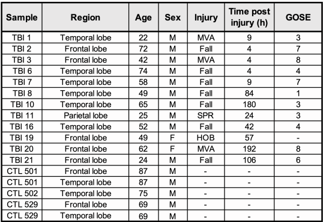
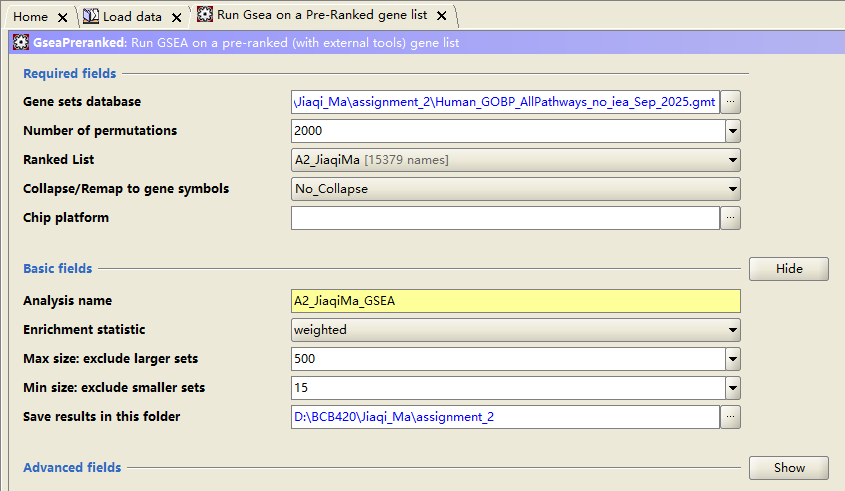
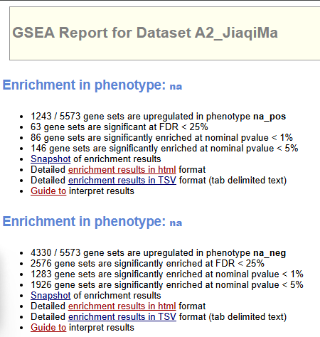
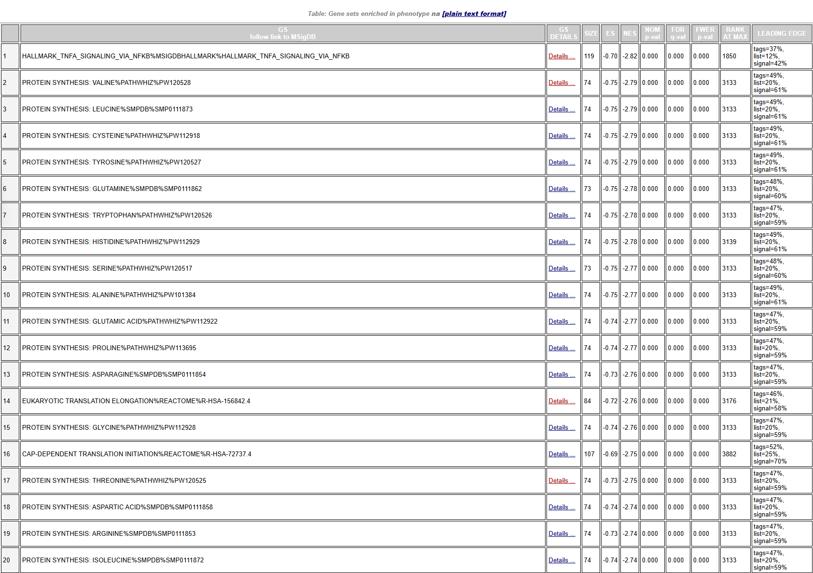

```{=html}
<style>
body {
  font-size: 16px;
}

caption {
  font-size: 14px;
  font-style: italic;
}
</style>
```

```{r setup, include=FALSE, echo=FALSE}
knitr::opts_chunk$set(
                      warning = FALSE, # suppressing warning messages
                      message = FALSE,
                      knitr.kable.max_rows = 5)
```

# Packages setup

```{r}
# Download
if (!requireNamespace("gprofiler2", quietly = TRUE))
  install.packages("gprofiler2")
if (!requireNamespace("GSA", quietly = TRUE))
  install.packages("GSA")
if (!requireNamespace("tibble", quietly = TRUE))
  install.packages("tibble")
if (!requireNamespace("knitr", quietly = TRUE))
  install.packages("knitr")
if (!requireNamespace("dplyr", quietly = TRUE))
  install.packages("dplyr")
if (!requireNamespace("HGNChelper", quietly = TRUE))
  install.packages("HGNChelper")

# Attach
library(dplyr)
library(tibble)
library(gprofiler2)
library(GSA)
library(knitr)
library(HGNChelper)
```

# Introduction to Assignment #1

## Dataset introduction

-   The choice of dataset is `GSE209552`, published by [Garze et al, 2023](https://doi.org/10.1016/j.celrep.2023.113395)
-   `GSE209552` contain both `snRNA-seq` and `bulk RNA-seq` data
-   Control: non-neuronal death postmortem brain
-   Treatment: Traumatic brain injury (TBI)



## Assignment #1 result introduction

### Quality control

-   Only `snRNA-seq` data were subject to analysis.
-   Sample `GSM6376814` was removed because of it low data quality indicate by lowest coverage, depth and highest mitochondrial transcript percentage.
-   Empirical threshold of 10% mitochondrial percentage was applied to remove any cell which has higher than 10% mitochondrial percent.
-   In the end, `2887/24621 = 11.7%` cells were removed.

### Normalization and scoring

-   `Log-Normalization` with a scale factor of `10000` was selected because it's well adapted to zero-inflated `snRNA-seq` data.
-   `Wilcoxon Rank-Sum test` was utilized to identify differentially expressed genes (DEGs).
-   `Bonferroni correction` was utilized to adjust `p-value`.

```         
##    Min. 1st Qu.  Median    Mean 3rd Qu.    Max. 
## 0.02469 0.60785 1.09461 1.26379 1.77515 8.30359
```

## Import Assignment #1 result

To avoid assignment #2 to inherits assignment #1's RAM issue. I choice only save needed `DEGs list` result from assignment #1 rather include assignment #1 as a child section suggested in [assignment #2 instruction](https://q.utoronto.ca/courses/415975/assignments/1653017?module_item_id=7359436). This is a way to trade RAM efficiency with reproducibility and code elegancy.

```         
# At the end of `A1_JiaqiMa.Rmd`
# Set the working directory to the parent directory of A1 and A2
setwd("~/projects/Jiaqi_Ma")

# Create a new directory storing the resulting object of A1
dir.create("a1_result", showWarnings = FALSE)

# Save resulting object
saveRDS(combined_seurat_filtered, file = "a1_result/a1_seurat_result.rds")
saveRDS(Condition_DE_list, file = "a1_result/a1_de_result.rds")
```

For the sake of reproducibility, I've pushed the `a1_de_result.rds` to my [github repo](https://github.com/bcb420-2026/Jiaqi_Ma/blob/main/a1_result/a1_de_result.rds) so that any machine can access this file.

Now, fetch the `DEGs` list from [github repo](https://github.com/bcb420-2026/Jiaqi_Ma/blob/main/a1_result/a1_de_result.rds) and save it to disk

```{r}
# Define the exact RAW GitHub URL for your RDS file
rds_url <- "https://raw.githubusercontent.com/bcb420-2026/Jiaqi_Ma/main/a1_result/a1_de_result.rds"

# Define a local destination path inside your working directory
dest_file <- "a1_de_result.rds"

# Download the binary file safely
tryCatch({
  if (!file.exists(dest_file)) {
    message("Downloading DE results from GitHub...")
    download.file(url = rds_url, destfile = dest_file, mode = "wb")
  }
  
  # Load it into your environment
  a1_de_result <- readRDS(dest_file)
  message("Successfully loaded the Differential Expression list.")
  
}, error = function(e) {
  stop("Critical Error: Failed to download or read the RDS file. Check your internet connection and URL.")
})

# Verify the structure to ensure row names (gene symbols) are intact
head(a1_de_result)

# Clean variable
rm(dest_file)
rm(rds_url)
```

# Modify ranking

As shown above, there exist multiple genes share same `p_val_adj`. This will create ambiguity while rank by `p_val_adj`. This is again another consequence of zero-inflation property of `snRNA-seq`. To address this, I combined `p_val_adj` and `avg_log2FC` to calculate another `p_FC` value.

$$\mathtt{p\_FC} = (1 - \mathtt{p\_val\_adj}) \times \mathtt{avg\_log2\_FC}$$

`(1 - p_val_adj)` is the probability of observed result is **NOT** due to randomness. Times with `avg_log2FC` yield a `expected average fold change` **NOT** due to randomness. The direction of regulation (positive `p_FC` implied upregulation in control) is preserved since none of the operation will alter the sign of `avg_log2FC`. The genes at the very top and button of the list corresponding to genes that have both low `p_val_adj` and high `avg_log2FC`.

```{r}
# Calculate the metric and sort, overwriting the object in place
a1_de_result <- a1_de_result %>%
  mutate(p_FC = (1 - p_val_adj) * avg_log2FC) %>%
  arrange(desc(p_FC))

# Verify the top upregulated genes now sit at the top of your dataframe
head(a1_de_result)
```

# Thresholded over-representation analysis (ORA) {#ORA}

Consult Barder lab's tutorial on [Run g:profiler from R](https://risserlin.github.io/CBW_pathways_workshop_R_notebooks/run-gprofiler-from-r.html) and `gprofiler2` package [vignettes](https://cran.r-project.org/web/packages/gprofiler2/vignettes/gprofiler2.html)

## DEGs thresholding and split

I will use the same threshold criteria utilized in [Garze et al, 2023](https://doi.org/10.1016/j.celrep.2023.113395) and split DEGs to up & down regulated genes.

**Note** Up-regulated means up regulated in `control` group compare to `tbi` group.

```{r}
# Define threshold criteria
p_val_adj_threshold <- 0.01

# split
# 1. Up-regulated genes
up_genes <- a1_de_result %>%
  rownames_to_column(var = "Gene") %>%
  filter(p_val_adj < p_val_adj_threshold & avg_log2FC > 0)

# 2. Down-regulated genes
down_genes <- a1_de_result %>%
  rownames_to_column(var = "Gene") %>%
  filter(p_val_adj < p_val_adj_threshold & avg_log2FC < 0)

# 3. All significant genes (for comparison as requested by the rubric)
all_sig_genes <- a1_de_result %>%
  rownames_to_column(var = "Gene") %>%
  filter(p_val_adj < p_val_adj_threshold)

# Print the sizes of the lists for the report
cat("Total genes before thresholding:", nrow(a1_de_result), "\n")
cat("Total significant genes: ", nrow(all_sig_genes), "\n")
cat("Significant genes percentage: ", nrow(all_sig_genes) / nrow(a1_de_result), "\n")
cat("Down-regulated genes: ", nrow(down_genes), "\n")
cat("Up-regulated genes: ", nrow(up_genes), "\n")

# Clean variable
rm(p_val_adj_threshold)
```

## Result {#ORA-result}

`g:profiler`([Kolberg et al, 2023](https://doi-org.myaccess.library.utoronto.ca/10.1093/nar/gkad347)), `g:GOSt` was utilized to conduct ORA with `Benjamini-Hochberg` to correct p value. The `R` interface of `g:profiler` is provided as `gprofiler2` package ([CRAN, gprofiler2](https://doi.org/10.32614/CRAN.package.gprofiler2)). I choice this method because this is the one taught in BCB240. The original paper ([Garze et al, 2023](https://doi.org/10.1016/j.celrep.2023.113395)) was using `clusterProfiler` ([Xu et al, 2024](https://doi.org/10.1038/s41596-024-01020-z)), but they didn't specify the method of choice to correct p value.

The choice of annotation data is `Gene ontology` ([The Gene Ontology Consortium, 2026](https://doi-org.myaccess.library.utoronto.ca/10.1093/nar/gkaf1292)). Specifically, annotate by `GO:BP` aligned with original paper ([Garze et al, 2023](https://doi.org/10.1016/j.celrep.2023.113395)).

The version of `gprofiler2` package is `0.2.4`; The version of annotation data is `e113_eg59_p19_6be52918`.

```{r}
# Run Thresholded ORA using gprofiler2
ora_results <- gost(
  query = list(
    "Up_regulated" = up_genes$Gene, 
    "Down_regulated" = down_genes$Gene, 
    "All_Significant" = all_sig_genes$Gene
  ),
  organism = "hsapiens", # GSE209552 is human postmortem brain data
  ordered_query = FALSE, # FALSE for strict thresholded ORA
  significant = TRUE,    # Only return statistically significant pathways
  exclude_iea = TRUE,    # Exclude Inferred from Electronic Annotation (high confidence only)
  correction_method = "fdr", # False Discovery Rate (Benjamini-Hochberg)
  sources = c("GO:BP")   # Restrict to Gene Ontology: Biological Process for interpretability
)

# Extract and print the number of significant genesets returned for each list
cat("Significant GO:BP pathways for All Significant genes:", 
    sum(ora_results$result$query == "All_Significant"), "\n")
cat("Significant GO:BP pathways for Down-regulated genes:", 
    sum(ora_results$result$query == "Down_regulated"), "\n")
cat("Significant GO:BP pathways for Up-regulated genes:", 
    sum(ora_results$result$query == "Up_regulated"), "\n")
```

`496` significant pathway/geneset were identified within in all significant genes; `579` significant pathway/geneset were identified within down-regulated genes; `112` significant pathway/geneset were identified within up-regulated genesNote the number of significant pathway identified in down-regulated genes is more than all significant genes.

```{r}
# Visualize by Manhattan plot
gostplot(ora_results, capped = FALSE, interactive = FALSE)
```

**Figure 2:** Manhattan plot of `GP:BP` result of all significant, up-regulated, and down-regulated genes. The top panel is all significant genes; The middle panel is all down-regulated significant genes; The bottom panel is all up-regulated significant genes. The Y-axis indicate `-log10` transformed adjusted p value; The X-axis indicate each enriched pathway/gene set.

```{r}
# Extract the main results dataframe
gost_res_df <- ora_results$result

# Define the exact columns you want to keep (avoiding list columns)
keep_cols <- c("term_id", "term_name", "p_value", "intersection_size")

# --- 1. Top 10 All Significant Pathways ---
# Filter rows for "All_Significant" and keep only the safe columns
all_subset <- gost_res_df[gost_res_df$query == "All_Significant", keep_cols]

# Use head() to grab the top 10
all_top10 <- head(all_subset, 10)

# Format p-value to scientific notation
all_top10$p_value <- formatC(all_top10$p_value, format = "e", digits = 2)

# Render the table
kable(all_top10, 
      row.names = FALSE, 
      caption = "Table 1: Top 10 All Significant GO:BP Pathways")

# --- 2. Top 10 Down-regulated Pathways ---
# Filter rows for "Down_regulated" and keep only the safe columns
down_subset <- gost_res_df[gost_res_df$query == "Down_regulated", keep_cols]

# Use head() to grab the top 10
down_top10 <- head(down_subset, 10)

down_top10$p_value <- formatC(down_top10$p_value, format = "e", digits = 2)

# Render the table
kable(down_top10, row.names = FALSE, caption = "Table 2: Top 10 Significantly Down-regulated GO:BP Pathways")

# --- 3. Top 10 Up-regulated Pathways ---
# Filter rows for "Up_regulated" and keep only the safe columns
up_subset <- gost_res_df[gost_res_df$query == "Up_regulated", keep_cols]

# Use head() to grab the top 10 (gprofiler2 pre-sorts by p-value)
up_top10 <- head(up_subset, 10)

up_top10$p_value <- formatC(up_top10$p_value, format = "e", digits = 2)

# Render the table
kable(up_top10, row.names = FALSE, caption = "Table 3: Top 10 Significantly Up-regulated GO:BP Pathways")

# Clean variable
rm(gost_res_df)
rm(keep_cols)
rm(all_subset)
rm(all_top10)
rm(down_subset)
rm(down_top10)
rm(up_subset)
rm(up_top10)
```

The pathways identified within all significant and down-regulated genes were generally cellular metabolism. Whereas the pathways identified within up-regulated genes were neuron specific, concentrate at projection, synapse assembly and transmission. Also, the pathway identified in all significant and down-regulated genes were more significant, indicate by lower `p-value` and greater `intersection_size`.

## Interpretation {#ORA-interpretation}

**Critical note:**Because of how I assign identity parameter in `Seurat::FindMarkers()` in assignment #1.

```         
Condition_DE_list <- FindMarkers(combined_seurat_filtered, ident.1 = "control", ident.2 = "tbi", group.by = "Condition")
```

The `up-regulation` meant `up-regulated in control`.

### Up-regulated (Higher in Control/Lower in TBI)

Pathways identified were concentrated in neuron-specific functions, like synaptic assembly and transmission. This enrichment might simply reflect control group's heather synapse activity state (i.e., damaged synaptic function in TBI group). The original paper ([Garze et al, 2023](https://doi.org/10.1016/j.celrep.2023.113395)) also captured this signal and further identified this signal was originated from `excitatory neurons`.

### Down-regulated (Lower in Control/Higher in TBI)

Pathways identified were concentrated in general terms like cellular process and metabolic function. While these terms exhibit statistically extremely low `p_value` and massive intersection sizes compare with Up-regulated gene, it's not as biologically relevant as specific term like synapse assembly enriched in up-regulated genes. The statistical significance of those general terms are likely result from their position at the top of the GO hierarchy rather than an indicator of high biological relevance. Thus the interpretation can be ambiguous.

While the data safely concludes that TBI alters baseline metabolic transcription, interpreting this as `hyperactive` or `healthy` metabolism is conflicts with literature ([Oft et al, 2024](https://doi-org.myaccess.library.utoronto.ca/10.1186/s12974-024-03177-6), [Haria et al, 2025](https://doi-org.myaccess.library.utoronto.ca/10.1016/j.bbr.2025.115697), [Demers-Marcil & Coles, 2022](https://doi-org.myaccess.library.utoronto.ca/10.1097/ACO.0000000000001183)) that characterizes TBI by profound metabolic failure. One explanation for this higher metabolic transcript observed in TBI is it's compensatory response that brain is trying to recover from existing metabolic failure by transcribe more metabolic gene.

### Compearsion between directional regulated genes and all DEGs

The top enriched pathways in the all DEGs analysis were very similar with the down-regulated list, heavily dominated by broad, top-level GO parent terms like `cellular process` and `metabolic process`. This similarity is a direct statistical artifact of ranking methodology that only rank based on `p value`. Consequently, the top pathway identified from all DEGs were occupied by statistically significant down-regulated pathway whereas more specific, biologically informative pathway captured in the up-regulated list are entirely eclipsed in the combined analysis. Thus it's not sufficient to conclude `metabolic activity` is more effected by TBI than `synaptic activity`.

# Non-thresholded Gene set Enrichment analysis {#GSEA}

Barder lab's tutorial on [Run GSEA from within R](https://risserlin.github.io/CBW_pathways_workshop_R_notebooks/run-gsea-from-within-r.html) state that `GSEA` doesn't have official R package to run. So I will use [GSEA desktop software](https://www.gsea-msigdb.org/gsea/index.jsp) to run `GSEA` and describe my process and result in text and figure.

## Process

### Generate .rnk file and fetch .gmt file {#GSEA-file-prepare}

`p_FC` value defined previously was utilized for ranking.

```{r}
# 1. Format the dataframe for GSEA
gsea_rnk <- a1_de_result %>%
  rownames_to_column(var = "Gene") %>%
  dplyr::select(Gene, p_FC) %>%                         # Keep ONLY the gene name and the ranking metric
  filter(!is.na(Gene) & !is.na(p_FC)) %>%        # Drop any rows with missing values
  group_by(Gene) %>%
  summarize(p_FC = max(p_FC)) %>%                # Resolve any rare duplicate genes by taking the max score
  arrange(desc(p_FC))                            # CRITICAL: Sort strictly in descending order

# 2. Extract current gene symbols from the ranked dataframe
current_symbols <- gsea_rnk$Gene

# 3. Run them through the HGNC database (this takes a few seconds)
# It identifies outdated aliases and provides the 'Suggested.Symbol'
hgnc_mapping <- checkGeneSymbols(current_symbols)

# 4. Merge the updated symbols back into your ranked dataframe
gsea_rnk_updated <- gsea_rnk %>%
  # Temporarily bind the mapping results
  bind_cols(Suggested_Symbol = hgnc_mapping$Suggested.Symbol,
            Is_Approved = hgnc_mapping$Approved) %>%
  # If a new valid symbol exists, use it. If not, keep the original.
  mutate(Final_Gene = ifelse(!is.na(Suggested_Symbol), Suggested_Symbol, Gene)) %>%
  # Handle the rare case where multiple old aliases map to the same new symbol
  group_by(Final_Gene) %>%
  summarize(p_FC = max(p_FC)) %>%
  arrange(desc(p_FC)) %>%
  # Rename column back to standard
  dplyr::select(Gene = Final_Gene, p_FC)

# 5. Export the bulletproof .rnk file to your working directory
write.table(gsea_rnk_updated, 
            file = "A2_JiaqiMa.rnk", 
            sep = "\t", 
            quote = FALSE,       # Prevents R from wrapping gene names in " "
            col.names = FALSE,   # GSEA prefers raw data without headers
            row.names = FALSE)

# Print a success message and check the file structure
cat("Successfully generated A2_JiaqiMa.rnk with", nrow(gsea_rnk_updated), "unique genes.\n")
head(gsea_rnk_updated)

# Clean variable
rm(gsea_rnk)
rm(gsea_rnk_updated)
rm(current_symbols)
rm(hgnc_mapping)
```

Fetch the `Sep_01_2025` .gmt file from [barder's lab](https://download.baderlab.org/EM_Genesets/September_01_2025/Human/symbol/Human_GOBP_AllPathways_noPFOCR_no_GO_iea_September_01_2025_symbol.gmt).

```{r}
# Define the exact URL for the Bader Lab GMT file
gmt_url <- "https://download.baderlab.org/EM_Genesets/September_01_2025/Human/symbol/Human_GOBP_AllPathways_noPFOCR_no_GO_iea_September_01_2025_symbol.gmt"

# Define the local destination file name in your working directory
dest_gmt_file <- "Human_GOBP_AllPathways_no_iea_Sep_2025.gmt"

# Execute the download
if (!file.exists(dest_gmt_file)) {
  download.file(url = gmt_url, destfile = dest_gmt_file)
} else {
  cat(".gmt File already exist\n")
}

# Clean variable
rm(gmt_url)
rm(dest_gmt_file)
```

### Method

Follow barder's lab [Module 2 lab - GSEA tutorial](https://baderlab.github.io/CBW_Pathways_2024/gsea-lab.html)

-   GSEA version: `v4.4.0`
-   Ranked DEGs: `A2_JiaqiMa.rnk`
-   Pathway data: `Human_GOBP_AllPathways_no_iea_Sep_2025.gmt`
-   Number of permutations: 2000
-   Collapse/Remap to gene symbols: No_Collapse
-   Max size: 500 (default)
-   Min size: 15 (default)



## Result {#GSEA-Result}



`5573 / 18971` pathway/geneset were remained from geneset size filters (min=15, max=500); `1243 / 5573` pathway/geneset were enriched in control; `4330 / 5573` pathway/geneset were enriched in TBI.



The top 20 down-regulated pathways can be generally categorized into 4 category.1) Stimuli and Sensory Perception; 2) Olfactory and smell function; 3) Ion metabolism and function; 4) Motile cilium and sperm motility.


The top 20 up-regulated pathways is more uniform, except the top 1 pathway involved in inflammation and immune response, the rest of 19 were all protein synthesis.

## Interpretation {#GSEA-Interpretation}

Just comparing the number of pathway identified, `GSEA` consist with `ORA`, both identified more pathway from down-regulated list.

### Up-regulated (Higher in Control/Lower in TBI)

...

### Down-regulated (Lower in Control/Higher in TBI)

...

### Compare with Thresholded analysis (ORA)

...

# Cytoscape Visualization

...

# Interpretation

...

# Question

## Thresholded analysis

1.  Which method did you choose and why?

-   I choose `g:profiler`'s `gprofiler2` R package, because this is the one taught in lecture.

-   Link to section: [Thresholded over-representation analysis (ORA)](#ORA)

2.  What annotation data did you use and why? What version of the annotation are you using?

-   I choose `Gene Ontology` because this is the one focused in lecture. More specifically `GO:BP` because the original paper ([Garze et al, 2023](https://doi.org/10.1016/j.celrep.2023.113395)) examined `GO:BP`. The version of annotation data is `e113_eg59_p19_6be52918`

-   Link to section: [Thresholded over-representation analysis (ORA), Result](#ORA-result)

3.  How many genesets were returned with what thresholds?

-   Number of genesets for All genes: 496

-   Number of genesets for Down-regulated genes: 579

-   Number of genesets for Up-regulated genes: 112

-   Link to section: [Thresholded over-representation analysis (ORA), Result](#ORA-result)

4.  How do these results compare to using the whole list (i.e all differentially expressed genes together vs. the up-regulated and down regulated differentially expressed genes separately)?

-   The whole list's result is very similar with Down-regulated's result, dominated by metabolic function. Up-regulated's result dominated by synaptic function.

-   Link to section: [Thresholded over-representation analysis (ORA), Result](#ORA-result)

5.  Interpretation

-   Link to section: [Thresholded over-representation analysis (ORA), Interpretation](#ORA-interpretation)

## Non-thresholded analysis

1.  Which method did you choose and why?

-   I choose [GSEA JAVA desktop](https://www.gsea-msigdb.org/gsea/index.jsp) v4.4.0, because `GSEA` doesn't have an official R package and setup `GSEA JAVA` in R seems tedious.

-   Link to section: [Non-thresholded Gene set Enrichment analysis](#GSEA)

2.  What annotation data did you use and why? What version of the annotation are you using?

-   I choose `Sep_01_2025` .gmt file from [barder's lab](https://download.baderlab.org/EM_Genesets/September_01_2025/Human/symbol/Human_GOBP_AllPathways_noPFOCR_no_GO_iea_September_01_2025_symbol.gmt). I've tried the latest `March_02.2026` .gmt file, but it's bugged at loading phase in `GSEA`, so I then switch to the second latest.

-   Link to section: [Non-thresholded Gene set Enrichment analysis, Generate .rnk file and fetch .gmt file](#GSEA-file-prepare)

3.  Summarize

-   Link to section: [Non-thresholded Gene set Enrichment analysis, Result](#GSEA-Result)

5.  Compare with thresholded analysis (ORA)

-   Link to section: [Non-thresholded Gene set Enrichment analysis, Interpretation](#GSEA-Interpretation)

## Cytoscape visualization

1.  How many nodes and how many edges in the resulting map? What thresholds were used to create this map?

-   ...

2.  What parameters did you use to annotate the network.

-   ...

3.  What are the major themes present in this analysis? Do they fit with the model? Are there any novel pathways or themes?

-   ...

## Interpretation

1.  Do the enrichment results support conclusions or mechanism discussed in the original paper? How do these results differ from the results you got from Assignment #2 thresholded methods

-   ...

2.  Can you find evidence, i.e. publications, to support some of the results that you see. How does this evidence support your result?

-   ...

# References {#references}
